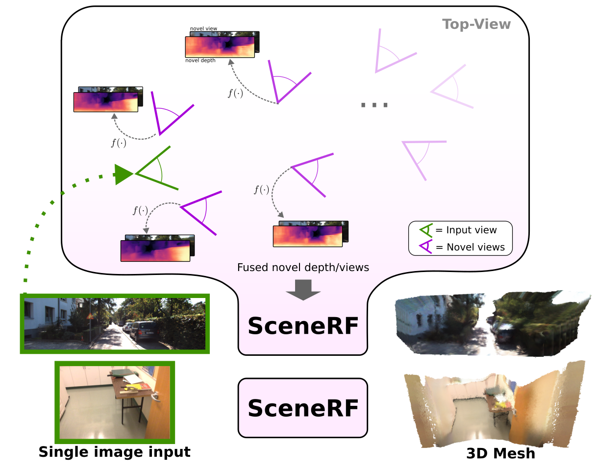
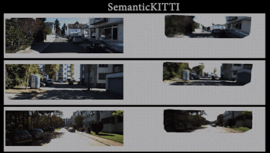
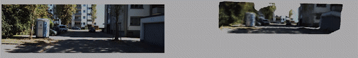
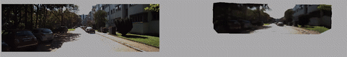
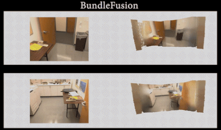
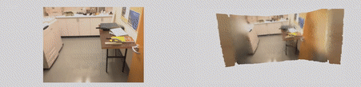

<div align='center'>

# SceneRF: Self-Supervised Monocular 3D Scene Reconstruction with Radiance Fields

ICCV 2023

[Anh-Quan Cao](https://anhquancao.github.io)&nbsp;&nbsp;&nbsp;
[Raoul de Charette](https://team.inria.fr/rits/membres/raoul-de-charette/)  
Inria, Paris, France.  

[](https://arxiv.org/abs/2212.02501) 
[](https://astra-vision.github.io/SceneRF/)

</div>

If you find this work or code useful, please cite our [paper](https://arxiv.org/abs/2212.02501) and [give this repo a star](https://github.com/astra-vision/SceneRF/stargazers):
```
@InProceedings{cao2023scenerf,
    author    = {Cao, Anh-Quan and de Charette, Raoul},
    title     = {SceneRF: Self-Supervised Monocular 3D Scene Reconstruction with Radiance Fields},
    booktitle = {ICCV},
    year      = {2023},
}
```

# Teaser
<!--  -->

<table>
<tr>
    <td align="center"><b>Outdoor</b> scenes</td>
    <td align="center"><b>Indoor</b> scenes</td>
</tr>
<tr>
    <td style="width:50%!important">
        
        <!--  -->
        <!--  -->
    </td>
    <td style="width:50%!important">
        
        <!--  -->
    </td>
</tr>
</table>


# Table of Content
- [News](#news) 
- [Installation](#installation)
  - [Conda](#using-conda)
  - [Docker](#using-docker)
- [Dataset](#dataset)
  - [KITTI](#kitti-dataset)
  - [Bundlefusion](#bundlefusion-dataset)
- [Training](#training)
  - [KITTI](#train-kitti)
  - [Bundlefusion](#train-bundlefusion)
- [Evaluation](#evaluation)
  - [KITTI](#evaluate-kitti)
      - [Pretrained model](#pretrained-model-on-kitti)
      - [Novel depths synthesis](#novel-depths-synthesis-on-kitti)
      - [Novel views synthesis](#novel-views-synthesis-on-kitti)
      - [Scene reconstruction](#scene-reconstruction-on-kitti)
  - [Bundlefusion](#evaluate-bundlefusion)
      - [Pretrained model](#pretrained-model-on-bundlefusion)
      - [Novel depths synthesis](#novel-depths-synthesis-on-bundlefusion)
      - [Novel views synthesis](#novel-views-synthesis-on-bundlefusion)
      - [Scene reconstruction](#scene-reconstruction-on-bundlefusion)
  - [Mesh extraction and visualization](#mesh-extraction-and-visualization)
- [Acknowledgment](#acknowledgment)

# News
- 05/12/2023: Check out our recent work [PaSCo: Urban 3D Panoptic Scene Completion with Uncertainty Awareness](https://astra-vision.github.io/PaSCo/) :rotating_light:
- 24/08/2023: Add code for Bundlefusion
- 14/07/2023: SceneRF has been accepted at [ICCV 2023](https://iccv2023.thecvf.com/)
- 15/03/2022: A new version of SceneRF is [available on arXiv.](https://arxiv.org/abs/2212.02501) :mega:. Code will be updated soon!
- 10/03/2022: We have included [instructions for drawing the mesh](https://github.com/astra-vision/SceneRF#mesh-extraction-and-visualization)

# Installation
## Using Conda

1. Create conda environment:

```
$ conda create -y -n scenerf python=3.7
$ conda activate scenerf
```
2. This code was implemented with python 3.7, pytorch 1.7.1 and CUDA 10.2. Please install [PyTorch](https://pytorch.org/): 

```
$ conda install pytorch==1.7.1 torchvision==0.8.2 torchaudio==0.7.2 cudatoolkit=10.2 -c pytorch
```

3. Install the dependencies:

```
$ cd scenerf/
$ pip install -r requirements.txt
```
4. Install tbb
```
$ conda install -c bioconda tbb=2020.2
```

5. Downgrade torchmetrics

```
$ pip install torchmetrics==0.6.0
```

6. Finally, install scenerf:

```
$ pip install -e ./
```

## Using Docker
Make sure the docker daemon is installed and running on your local machine.

1. Build docker container
```
$ docker build -t scene-rf .
```

2. Run interactive container session
```
$ docker run -it scene-rf
```

If the container should be deleted after usage, the ```-rm``` flag can be used.
If GPUs are available, the ```--gpus all``` flag can be used.
For more information, follow this [LINK](https://docs.docker.com/config/containers/resource_constraints/)


# Dataset
## KITTI dataset
1. To train and evaluate novel depths/views synthesis, please download on [KITTI Odometry website](http://www.cvlibs.net/datasets/kitti/eval_odometry.php) the following data: 
    - Odometry data set (calibration files, 1 MB)
    - Odometry data set (color, 65 GB)
    - Odometry ground truth poses (4 MB)
    - Velodyne laser data, 80 GB

2. To evaluate scene reconstruction, please download **the SemanticKITTI voxel data (700 MB)** and **all extracted data for the training set (3.3 GB)**  on [Semantic KITTI download website](http://www.semantic-kitti.org/dataset.html).

3. Create a folder to store preprocess data at `/path/to/kitti/preprocess/folder`.

4. Store paths in environment variables for faster access (**Note: folder 'dataset' is in /path/to/kitti**):    

    ```
    $ export KITTI_PREPROCESS=/path/to/kitti/preprocess/folder
    $ export KITTI_ROOT=/path/to/kitti 
    ```
## Bundlefusion dataset
1. Please download 8 scenes from [Bundlefusion website](https://graphics.stanford.edu/projects/bundlefusion/) and unzip them to `/gpfsdswork/dataset/bundlefusion` (change to your dataset directory).
2. Store paths in environment variables for faster access:    
    ```
    $ export BF_ROOT=/gpfsdswork/dataset/bundlefusion
    ```

# Training
## Train KITTI
1. Create folders to store training logs at **/path/to/kitti/logdir**.

2. Store in an environment variable:

    ```
    $ export KITTI_LOG=/path/to/kitti/logdir
    ```

3. Train scenerf using 4 v100-32g GPUs with batch_size of 4 (1 item per GPU):

    ```
    $ cd scenerf/
    $ python scenerf/scripts/train_kitti.py \
        --bs=4 --n_gpus=4 \
        --enable_log=True \
        --preprocess_root=$KITTI_PREPROCESS \
        --root=$KITTI_ROOT \
        --logdir=$KITTI_LOG \
        --n_gaussians=4 --n_pts_per_gaussian=8  \
        --max_epochs=50 --exp_prefix=Train
    ```
## Train Bundlefusion

1. Create folders to store training logs at **/gpfsscratch/rech/kvd/uyl37fq/logs/monoscene2/bundlefusion** (Change to your directory).

2. Store in an environment variable:

    ```
    $ export BF_LOG=/gpfsscratch/rech/kvd/uyl37fq/logs/monoscene2/bundlefusion
    ```

3. Train scenerf using 4 v100-32g GPUs with batch_size of 4 (1 item per GPU):

    ```
    $ cd scenerf/
    $ python scenerf/scripts/train_bundlefusion.py --bs=4 --n_gpus=4 \
        --n_rays=2048 --lr=2e-5 \
        --enable_log=True \
        --root=$BF_ROOT \
        --logdir=$BF_LOG
    ```

# Evaluation
## Evaluate KITTI
Create folders to store intermediate evaluation data at `/path/to/evaluation/save/folder` and reconstruction data at `/path/to/reconstruction/save/folder`.

```
$ export EVAL_SAVE_DIR=/path/to/evaluation/save/folder
$ export RECON_SAVE_DIR=/path/to/reconstruction/save/folder
```
### Pretrained model on KITTI
Please download the [pretrained model](https://www.rocq.inria.fr/rits_files/computer-vision/scenerf/scenerf_kitti.ckpt).
    
### Novel depths synthesis on KITTI
Supposed we obtain the model from the training step at `/path/to/model/checkpoint/last.ckpt`. We follow the steps below to evaluate the novel depths synthesis performance. 
1. Compute the depth metrics on all frames in each sequence, additionally grouped by the distance to the input frame.

```
$ cd scenerf/
$ python scenerf/scripts/evaluation/save_depth_metrics.py \
    --eval_save_dir=$EVAL_SAVE_DIR \
    --root=$KITTI_ROOT \
    --preprocess_root=$KITTI_PREPROCESS \
    --model_path=/path/to/model/checkpoint/last.ckpt
```
2. Aggregate the depth metrics from all sequences.
```
$ cd scenerf/
$ python scenerf/scripts/evaluation/agg_depth_metrics.py \
    --eval_save_dir=$EVAL_SAVE_DIR \
    --root=$KITTI_ROOT \
    --preprocess_root=$KITTI_PREPROCESS
```

### Novel views synthesis on KITTI
Given the trained model at `/path/to/model/checkpoint/last.ckpt`, the novel views synthesis performance is obtained as followed:
1. Render an RGB image for every frame in each sequence.
```
$ cd scenerf/
$ python scenerf/scripts/evaluation/render_colors.py \
    --eval_save_dir=$EVAL_SAVE_DIR \
    --root=$KITTI_ROOT \
    --preprocess_root=$KITTI_PREPROCESS \
    --model_path=/path/to/model/checkpoint
```
2. Compute the metrics, additionally grouped by the distance to the input frame.
```
$ cd scenerf/
$ python scenerf/scripts/evaluation/eval_color.py --eval_save_dir=$EVAL_SAVE_DIR
```
### Scene reconstruction on KITTI
1. Generate novel views/depths for reconstructing scene.
```
$ cd scenerf/
$ python scenerf/scripts/reconstruction/generate_novel_depths.py \
    --recon_save_dir=$RECON_SAVE_DIR \
    --root=$KITTI_ROOT \
    --preprocess_root=$KITTI_PREPROCESS \
    --model_path=/path/to/model/checkpoint \
    --angle=10 --step=0.5 --max_distance=10.1
```

2. Convert the novel views/depths to TSDF volume. **Note: the angle, step, and max_distance should match the previous step.**
```
$ cd scenerf/
$ python scenerf/scripts/reconstruction/depth2tsdf.py \
    --recon_save_dir=$RECON_SAVE_DIR \
    --root=$KITTI_ROOT \
    --preprocess_root=$KITTI_PREPROCESS \
    --angle=10 --step=0.5 --max_distance=10.1
```
3. Compute scene reconstruction metrics using the generated TSDF volumes.
```
$ cd scenerf/
$ python scenerf/scripts/evaluation/eval_sr.py \
    --recon_save_dir=$RECON_SAVE_DIR \
    --root=$KITTI_ROOT \
    --preprocess_root=$KITTI_PREPROCESS
```


## Evaluate Bundlefusion
Create folders to store intermediate evaluation data at `/gpfsscratch/rech/kvd/uyl37fq/to_delete/eval` and reconstruction data at `/gpfsscratch/rech/kvd/uyl37fq/to_delete/recon`.

```
$ export EVAL_SAVE_DIR=/gpfsscratch/rech/kvd/uyl37fq/to_delete/eval
$ export RECON_SAVE_DIR=/gpfsscratch/rech/kvd/uyl37fq/to_delete/recon
```

### Pretrained model on Bundlefusion
Please download the [pretrained model](https://www.rocq.inria.fr/rits_files/computer-vision/scenerf/scenerf_bundlefusion.ckpt).
    
### Novel depths synthesis on Bundlefusion
Supposed we obtain the model from the training step at `/gpfsscratch/rech/kvd/uyl37fq/to_delete/last.ckpt` (Change to your location). We follow the steps below to evaluate the novel depths synthesis performance. 
1. Compute the depth metrics on all frames in each sequence, additionally grouped by the distance to the input frame.

```
$ cd scenerf/
$ python scenerf/scripts/evaluation/save_depth_metrics_bf.py \
    --eval_save_dir=$EVAL_SAVE_DIR \
    --root=$BF_ROOT \
    --model_path=/gpfsscratch/rech/kvd/uyl37fq/to_delete/last.ckpt
```
2. Aggregate the depth metrics from all sequences.
```
$ cd scenerf/
$ python scenerf/scripts/evaluation/agg_depth_metrics_bf.py \
    --eval_save_dir=$EVAL_SAVE_DIR \
    --root=$BF_ROOT
```

### Novel views synthesis on Bundlefusion
Given the trained model at `/gpfsscratch/rech/kvd/uyl37fq/to_delete/last.ckpt`, the novel views synthesis performance is obtained as followed:
1. Render an RGB image for every frame in each sequence.
```
$ cd scenerf/
$ python scenerf/scripts/evaluation/render_colors_bf.py \
    --eval_save_dir=$EVAL_SAVE_DIR \
    --root=$BF_ROOT \
    --model_path=/gpfsscratch/rech/kvd/uyl37fq/to_delete/last.ckpt
```
2. Compute the metrics, additionally grouped by the distance to the input frame.
```
$ cd scenerf/
$ python scenerf/scripts/evaluation/eval_color_bf.py --eval_save_dir=$EVAL_SAVE_DIR
```


## Scene reconstruction on Bundlefusion
1. Generate novel views/depths for reconstructing scene.
```
$ cd scenerf/
$ python scenerf/scripts/reconstruction/generate_novel_depths_bf.py \
    --recon_save_dir=$RECON_SAVE_DIR \
    --root=$BF_ROOT \
    --model_path=/gpfsscratch/rech/kvd/uyl37fq/to_delete/last.ckpt \
    --angle=30 --step=0.2 --max_distance=2.1
```

2. Convert the novel views/depths to TSDF volume. **Note: the angle, step, and max_distance should match the previous step.**
```
$ cd scenerf/
$ python scenerf/scripts/reconstruction/depth2tsdf_bf.py \
    --recon_save_dir=$RECON_SAVE_DIR \
    --root=$BF_ROOT \
    --angle=30 --step=0.2 --max_distance=2.1
```
3. Generate the voxel ground-truth for evaluation.
```
$ cd scenerf/
$ python scenerf/scripts/reconstruction/generate_sc_gt_bf.py \
    --recon_save_dir=$RECON_SAVE_DIR \
    --root=$BF_ROOT
```

4. Compute scene reconstruction metrics using the generated TSDF volumes.
```
$ cd scenerf/
$ python scenerf/scripts/evaluation/eval_sc_bf.py \
    --recon_save_dir=$RECON_SAVE_DIR \
    --root=$BF_ROOT
```

## Mesh extraction and visualization
Mesh can be obtained from [this line for KITTI](https://github.com/astra-vision/SceneRF/blob/main/scenerf/scripts/reconstruction/depth2tsdf.py#L107) and from [this line for Bundlefusion](https://github.com/astra-vision/SceneRF/blob/main/scenerf/scripts/reconstruction/depth2tsdf_bf.py#L119) , and drawed with open3d as following:
```
import open3d as o3d

mesh = o3d.geometry.TriangleMesh()
mesh.triangle_normals = o3d.utility.Vector3dVector(data['norms'])
mesh.vertices = o3d.utility.Vector3dVector(data['verts'])
mesh.triangles = o3d.utility.Vector3iVector(data['faces'])
mesh.vertex_colors = o3d.utility.Vector3dVector(data['colors'].astype(np.float) / 255.0)

o3d.visualization.draw_geometries([mesh])
```


# Acknowledgment
The work was partly funded by the French project SIGHT (ANR-20-CE23-0016) and conducted in the SAMBA collaborative project, co-funded by BpiFrance in the Investissement d’Avenir Program. It was performed using HPC resources from GENCI–IDRIS (Grant 2021-AD011012808, 2022-AD011012808R1, and 2023-AD011014102). We thank Fabio Pizzati and Ivan Lopes for their kind proofreading and all Astra-vision group members of Inria Paris for the insightful discussions.
